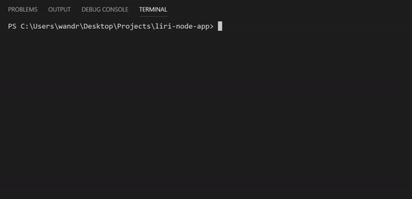

# Liri Node App

## Overview

The LIRI Bot is a "Language Interpretation and Recognition Interface". It works by using set commands commands to retrieve information regarding movie and music information. 

Take a look at how some of the commands work:

1. The "concert-this" command

2. The "movie-this" command

3. The "spotify-this-song" command

## Installing 

Follow the steps below to run the LIRI Bot in your own terminal:

1. Within your terminal clone the git repository. You can find the repository [here](https://github.com/wandrew8/liri-node-app).

2. In order to run this program an API key from Spotify is required. You can sign up for an API Key [here](https://developer.spotify.com/dashboard/login)

3. Once you've obtained your key, copy the information into a .env file with the format below. 

            SPOTIFY_ID=Your Spotify API Key 
            SPOTIFY_SECRET=Spotify Secret Number

 Note: Your API key and Spotify Secret should not contain spaces. Quotation marks are NOT needed. make sure the .env file is within the main directory of your cloned repository. 

4. Open the liri.js file in the terminal and install the packages using the following command. Press enter to install:

            npm install

5. Now you are ready to use the LIRI Bot. Run the liri.js file in the terminal and type (node .\liri.js) followed by one of the commands below with the corresponding parameters.

| Command | Parameter | Function |
| ---------------- |: --------------------- :| -------------------------- :|
| concert-this | Artist Name | Pulls a list of upcoming concerts |
| spotify-this-song | Artist Name | Pulls up artist and album info |
| movie-this | Movie Title | Pulls up information on the movie |
| do-what-this-says | none | Pulls a command and parameter from an external text file |

Here are two examples of how to search using the LIRI Bot:
 - node .\liri.js concert-this taylor swift
 - node .\liri.js spotify-this-song like a rolling stone

