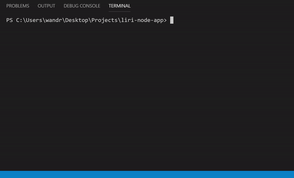

# Liri Node App

## Overview

The LIRI Bot is a "Language Interpretation and Recognition Interface". It works by using set commands to retrieve information regarding movie and music information. This program uses many different third-party Node packages to retrieve the requested information. You can find a link to each of them here:

 [Axios](https://www.npmjs.com/package/axios)
 [node-spotify-api](https://www.npmjs.com/package/node-spotify-api)
 [moment](https://www.npmjs.com/package/moment)
 [dotenv](https://www.npmjs.com/package/dotenv)

Take a look at how the LIRI Bot works:

## Installing 

Follow the steps below to run the LIRI Bot in your own terminal:

1. Within your terminal clone [this](https://github.com/wandrew8/liri-node-app) git repository. 

2. In order to run this program an API key from Spotify is required. You can sign up for an API Key [here](https://developer.spotify.com/dashboard/login).

3. Once you've obtained your key, copy the information into a .env file with the format below. 

            SPOTIFY_ID=Your Spotify API Key 
            SPOTIFY_SECRET=Spotify Secret Number

 Note: Your API key and Spotify Secret should not contain spaces or quotation marks. Make sure the .env file is within the main directory of your cloned repository. 

4. Open the liri.js file in the terminal and install the packages using the following command. Press enter to install:

            npm install

5. Now you are ready to use the LIRI Bot. Run the liri.js file in the terminal and type (node .\liri.js) followed by one of the commands below with the corresponding parameters.

## How It Works

Within the liri.js terminal enter the following into the command line:

            node .\liri.js 
            
Follow the above with one of the commands below along with its required parameters. Then press ENTER to run the command.

concert-this "Artist Name" | This command pulls a list of upcoming concerts for the specified artist.
spotify-this-song "Artist Name" | This command pulls up artist and album info for the corresponding artist.
movie-this "Movie Title" | This command pulls information on the searched movie.
do-what-this-says "no parameters" | Pulls a command and parameter from an external text file. 

Here are two examples of how to search using the LIRI Bot:
 - node .\liri.js concert-this taylor swift
 - node .\liri.js spotify-this-song like a rolling stone

 ## Contact Me

 I'm Andrew Weiss. If you have any questions of suggestions you can contact me at my github account [wandrew8](https://github.com/wandrew8)

